#  Proyecto: API Gateway y AWS Lambda

Este proyecto implementa una **REST API** utilizando Amazon API Gateway, que invoca una función AWS Lambda para procesar solicitudes. La aplicación es ficticia y sirve como práctica de integración entre API Gateway y Lambda.

---

##  Objetivo

- Desplegar una REST API mediante **Amazon API Gateway**.
- Configurar un endpoint que invoque una función **AWS Lambda**.
- Realizar pruebas de invocación desde API Gateway y mediante la URL pública.

---

##  Servicios utilizados

| Servicio        | Función                                                      |
|-----------------|--------------------------------------------------------------|
| **AWS Lambda**  | Ejecuta el código backend de forma serverless.               |
| **Amazon API Gateway** | Expone la API REST y gestiona las solicitudes HTTP.   |

---

##  Pasos realizados

1. **Creación de la función Lambda** llamada `labfunction`.

   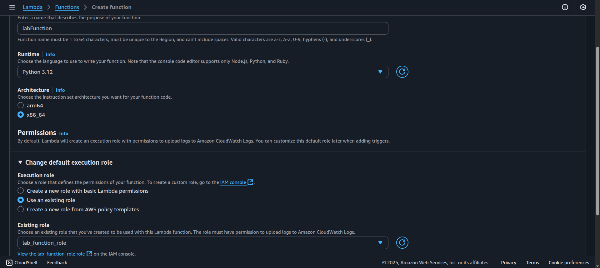

2. Inserción del código de ejemplo `sample_code` en la función Lambda y despliegue.

   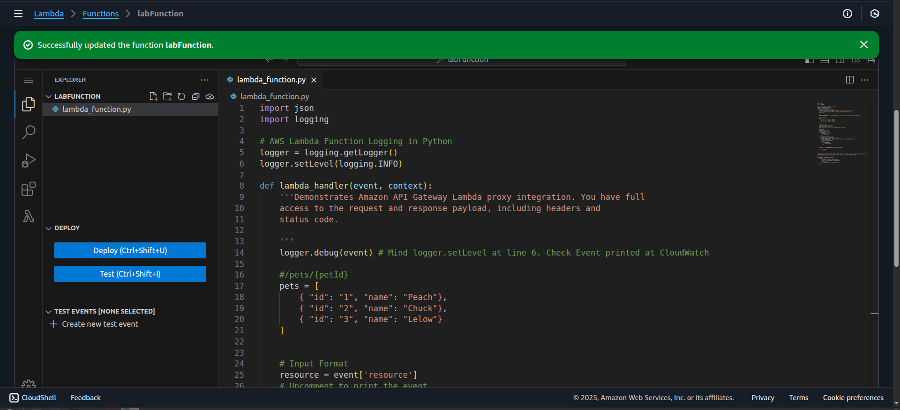

3. Asignación del rol con permisos **AWSLambdaBasicExecutionRole**.

   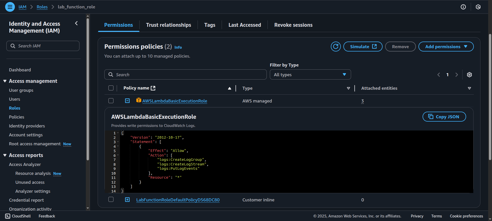

4. Creación de un **Test Event** para validar la función Lambda.

   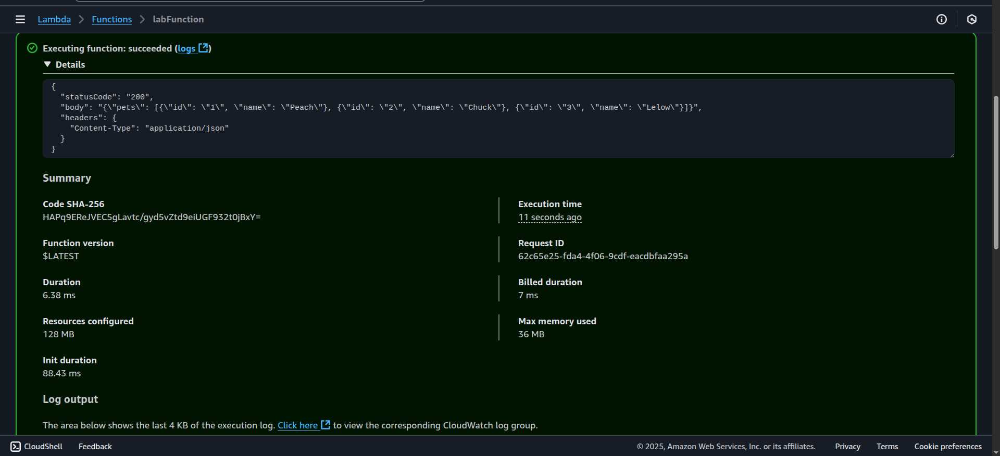

5. Creación de una **REST API** en Amazon API Gateway, con endpoint en modo **Regional**.

   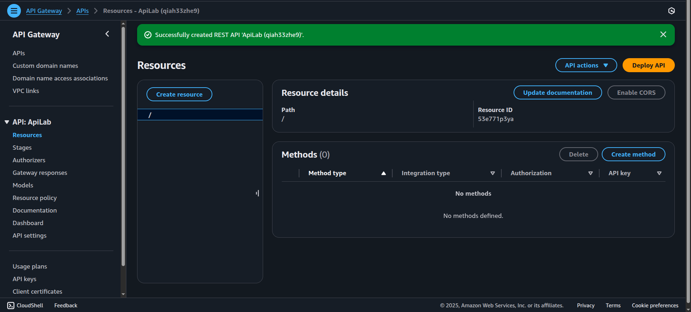

6. Creación del recurso `/pets` y su método GET con integración Lambda Proxy.

   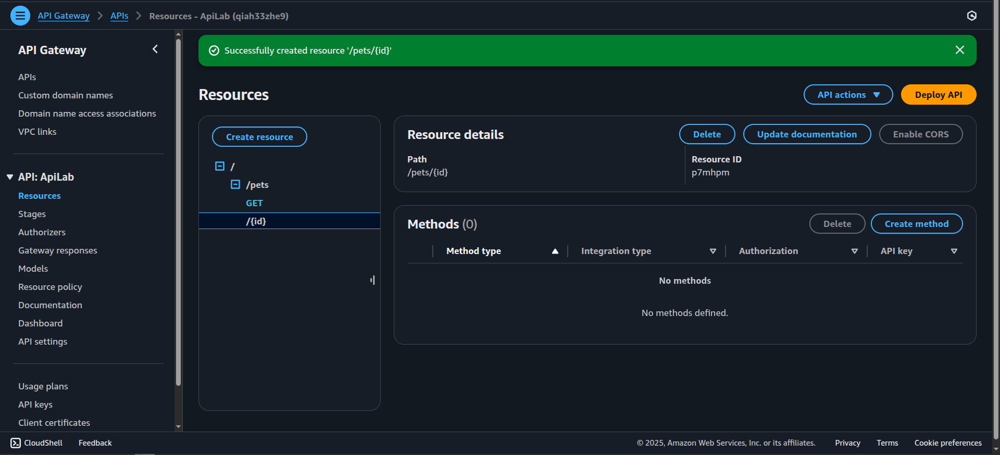 
   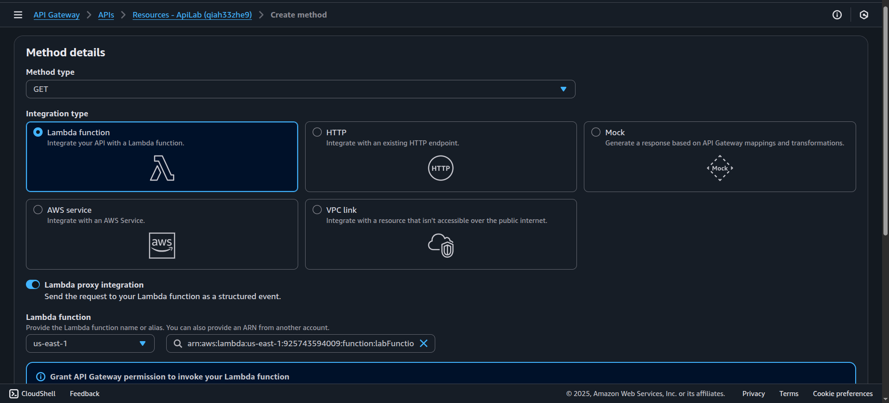 
   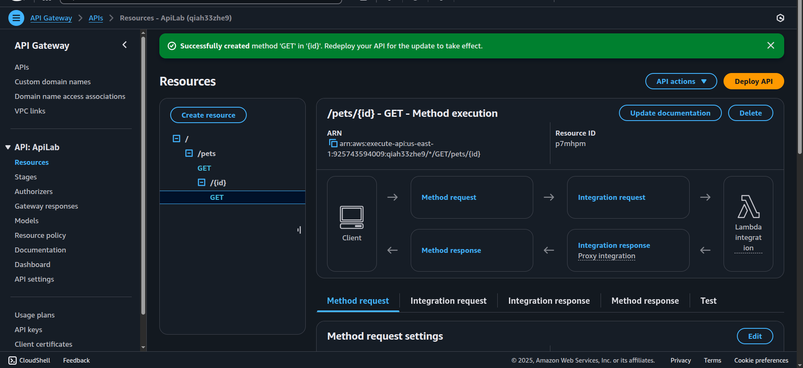

7. Prueba del método GET en `/pets`.

   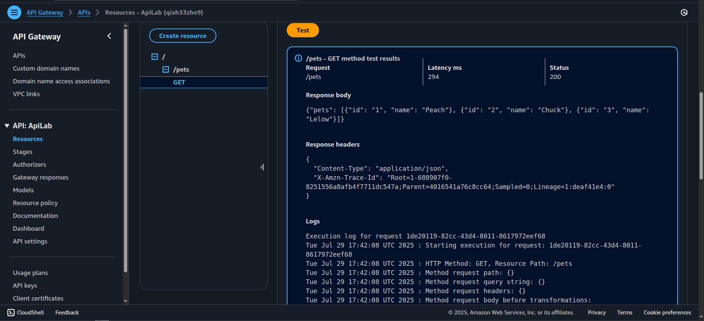

8. Creación del subrecurso `/{id}` dentro de `/pets` y configuración de método GET.

   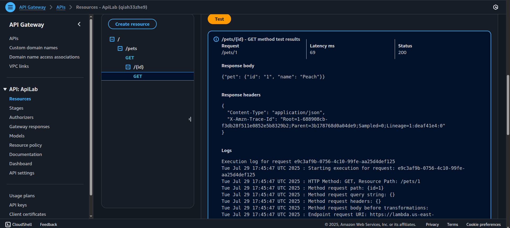

9. **Deploy** de la API y validación de funcionamiento mediante la URL generada.

   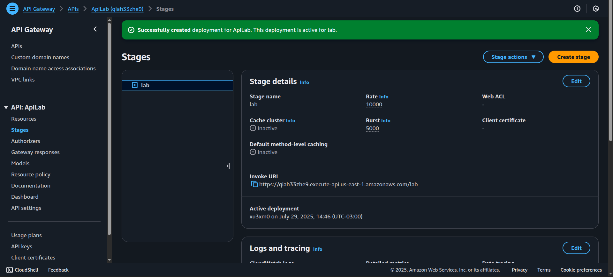 
   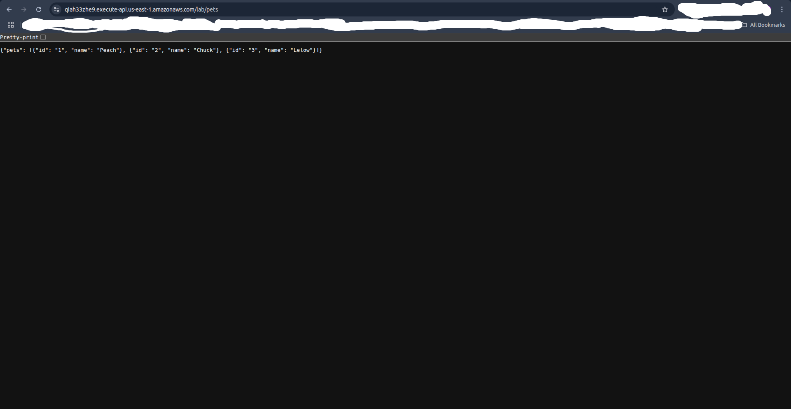

---

##  Problemas encontrados y soluciones

*(No se registraron problemas técnicos durante la implementación.)*

---

##  Notas adicionales

- El rol asociado a la función Lambda tiene permisos **`AWSLambdaBasicExecutionRole`** gestionados por AWS.
- La API fue desplegada con configuración Regional.

---

##  Resultado esperado

- Endpoint `/pets` disponible vía HTTP GET.
- Endpoint `/pets/{id}` que acepta un parámetro dinámico.
- Invocación correcta de la función Lambda desde API Gateway.
